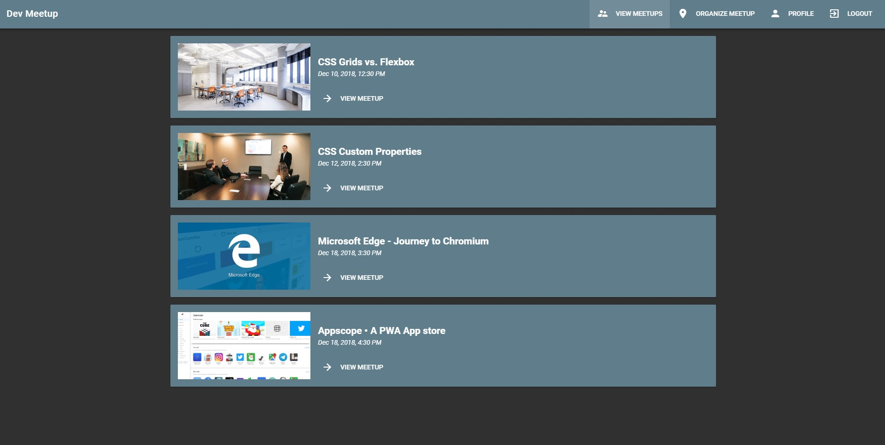

# Developer Meetup Organizer

A simple and quick meetup event manager for web developers. By using a Single Page Application structure, the website has zero loading between transitions. Using the Firebase realtime database as a storage solution, the App feels lighting fast.

This App uses Veutify to implement eye-catching Material Design components with a depth based hierarchy model.

This App features Firebase supported secure user Authentication. Users can effortlessly sign up within seconds and start organizing their first meetup!

### Try it • https://devmeetup-vue-js.firebaseapp.com/

## Landing Page

## Meetup Events List

## Built using

• VueJS Front-End

• Vuetify Component library

• Firebase Back-End
